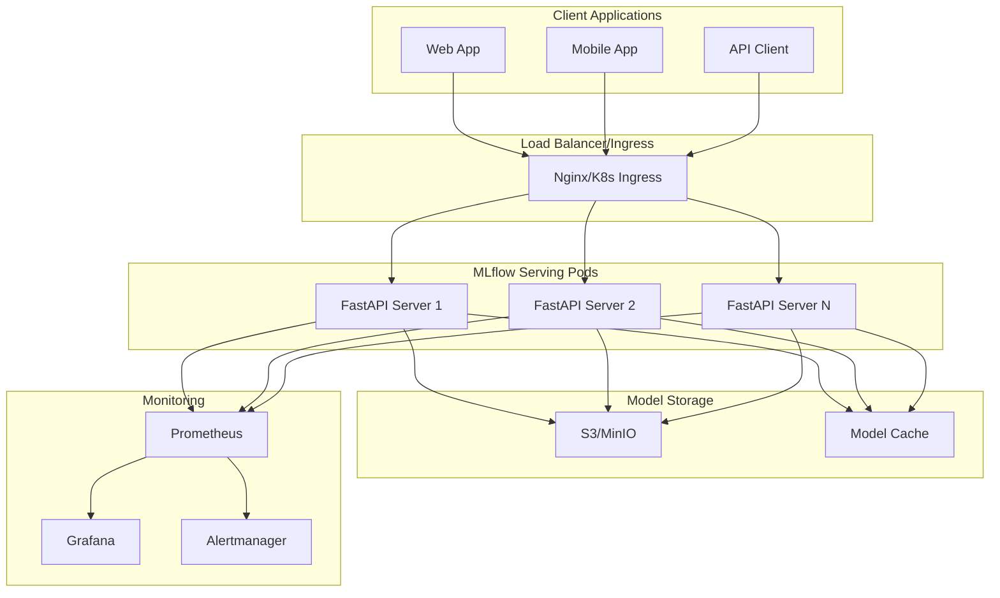

# MLflow Model Serving - Containerized Deployment Solution

A production-ready, containerized serving solution for MLflow models with S3 integration, FastAPI, and comprehensive monitoring capabilities.

## 🚀 Features

- **🔧 MLflow Integration**: Native support for MLflow PyFunc models with automatic artifact downloading from S3
- **⚡ FastAPI**: High-performance REST API with automatic OpenAPI documentation  
- **🗂️ S3 Compatibility**: Works with AWS S3, MinIO, and other S3-compatible storage
- **🐳 Container Ready**: Multi-stage Docker builds with security best practices
- **☸️ Kubernetes Native**: Complete K8s manifests with monitoring, autoscaling, and ingress
- **🧪 Comprehensive Testing**: Unit, integration, and API tests with 80%+ coverage
- **📊 Observability**: Prometheus metrics, structured logging, and health checks
- **🔄 CI/CD Ready**: GitHub Actions, Docker Compose, and deployment automation

## 📋 Table of Contents

- [Quick Start](#quick-start)
- [Architecture](#architecture)
- [Installation](#installation)
- [Configuration](#configuration)
- [API Documentation](#api-documentation)
- [Deployment](#deployment)
- [Monitoring](#monitoring)
- [Testing](#testing)
- [Development](#development)
- [Troubleshooting](#troubleshooting)

## 🏃‍♂️ Quick Start

### Prerequisites

- Docker and Docker Compose
- Python 3.9+
- Ozone S3 gateway (or MLflow model artifacts in S3-compatible storage)

### Step-by-Step E2E Execution

#### 1. Environment Setup

```bash
# Navigate to demo serving directory
cd demo_serving

# Set up virtual environment (if not already done)
source ../.venv/bin/activate

# Copy and configure environment
cp .env.example .env
```

#### 2. Configure Ozone S3 Gateway

```bash
# Set Ozone S3 credentials
export AWS_ACCESS_KEY_ID=hadoop
export AWS_SECRET_ACCESS_KEY=hadoop
export AWS_DEFAULT_REGION=us-east-1
export MLFLOW_S3_ENDPOINT_URL=http://localhost:9878
```

#### 3. Download Model Artifacts

```bash
# Download model artifacts from Ozone S3 to local cache
make download-model

# This downloads artifacts to /tmp/mlflow_models/artifacts/
# Uses configuration from .env file
```

#### 4. Export Model for Standalone Deployment

```bash
# Export model to standalone Docker package
make export-model-run

# This creates a complete deployment package in ./exported_model/
# Uses both S3 and local cache as fallback
```

#### 5. Deploy Exported Model

```bash
# Navigate to exported model directory
cd exported_model

# Build Docker image
./build.sh

# Start container
./run.sh

# Test API endpoints
./test.sh
```

#### 6. Verify Standalone Deployment

```bash
# Health check
curl http://localhost:8000/api/v1/health

# Test prediction
curl -X POST http://localhost:8000/api/v1/predict \
  -H "Content-Type: application/json" \
  -d '{"question": "What is machine learning?"}'

# View API documentation
open http://localhost:8000/docs
```

### Alternative: Docker Compose Deployment

```bash
# Start the complete stack (app + dependencies)
docker-compose up -d

# Or start with MinIO for local testing
docker-compose --profile with-mlflow up -d

# Check service status
docker-compose ps
```

## 🏗️ Architecture



### Key Components

- **FastAPI Application**: High-performance REST API with automatic validation
- **S3 Client**: Robust artifact downloading with retry logic and caching
- **Model Loader**: Lazy loading with memory management and cache verification
- **Prediction Service**: Thread-safe prediction handling with metrics collection
- **Health System**: Comprehensive health checks and readiness probes

## 📦 Installation

### Development Setup

```bash
# Create virtual environment
python -m venv .venv
source .venv/bin/activate  # On Windows: .venv\Scripts\activate

# Install dependencies
pip install -r requirements-dev.txt

# Install pre-commit hooks (optional)
pre-commit install
```

### Production Deployment

Choose your deployment method:

- [Docker Compose](#docker-deployment)
- [Kubernetes](#kubernetes-deployment)  
- [Standalone](#standalone-deployment)

## ⚙️ Configuration

### Environment Variables

| Variable | Description | Default | Required |
|----------|-------------|---------|-----------|
| `MLFLOW_MODEL_URI` | MLflow model registry URI | `models:/langchain-e2e-model/1` | ✅ |
| `MLFLOW_ARTIFACT_PATH` | S3 path to model artifacts | `s3://aiongenbucket/production_data/mlartifacts/1` | ✅ |
| `S3_ENDPOINT_URL` | S3/Ozone endpoint URL | `http://localhost:9878` | ✅ |
| `S3_ACCESS_KEY` | S3/Ozone access key | `hadoop` | ✅ |
| `S3_SECRET_KEY` | S3/Ozone secret key | `hadoop` | ✅ |
| `S3_BUCKET_NAME` | S3/Ozone bucket name | `aiongenbucket` | ✅ |
| `HOST` | Server host | `0.0.0.0` | ❌ |
| `PORT` | Server port | `8000` | ❌ |
| `LOG_LEVEL` | Logging level | `info` | ❌ |
| `WORKERS` | Number of workers | `1` | ❌ |
| `MODEL_CACHE_DIR` | Local cache directory | `/tmp/mlflow_models` | ❌ |
| `METRICS_ENABLED` | Enable Prometheus metrics | `true` | ❌ |

### Configuration File

```bash
# Copy and edit configuration
cp .env.example .env
```

Example `.env` for Ozone S3 Gateway:
```env
# MLflow Configuration  
MLFLOW_MODEL_URI=models:/langchain-e2e-model/1
MLFLOW_ARTIFACT_PATH=s3://aiongenbucket/production_data/mlartifacts/1

# Ozone S3 Gateway Configuration
S3_ENDPOINT_URL=http://localhost:9878
S3_ACCESS_KEY=hadoop
S3_SECRET_KEY=hadoop
S3_BUCKET_NAME=aiongenbucket

# Server Configuration
HOST=0.0.0.0
PORT=8000
LOG_LEVEL=info
WORKERS=1
```

Example `.env` for AWS S3:
```env
# MLflow Configuration
MLFLOW_MODEL_URI=models:/my-genai-model/1
MLFLOW_ARTIFACT_PATH=s3://my-bucket/production/artifacts/1

# AWS S3 Configuration  
S3_ENDPOINT_URL=https://s3.amazonaws.com
S3_ACCESS_KEY=your-access-key
S3_SECRET_KEY=your-secret-key
S3_BUCKET_NAME=my-model-bucket

# Server Configuration
HOST=0.0.0.0
PORT=8000
LOG_LEVEL=info
WORKERS=2
```

## 📚 API Documentation

### Core Endpoints

#### Health & Status
- `GET /api/v1/health` - Health check
- `GET /api/v1/ready` - Readiness probe  
- `GET /api/v1/info` - Model information
- `GET /api/v1/metrics` - Prometheus metrics

#### Predictions
- `POST /api/v1/predict` - Single prediction
- `POST /api/v1/batch-predict` - Batch predictions
- `POST /api/v1/invocations` - MLflow compatible endpoint

#### Management
- `POST /api/v1/reload` - Reload model
- `DELETE /api/v1/cache` - Clear model cache
- `POST /api/v1/stats/reset` - Reset statistics

### API Examples

#### Single Prediction
```bash
curl -X POST http://localhost:8000/api/v1/predict \
  -H "Content-Type: application/json" \
  -d '{
    "question": "What is artificial intelligence?"
  }'
```

Response:
```json
{
  "question": "What is artificial intelligence?",
  "response": "Artificial intelligence (AI) is a branch of computer science...",
  "prediction_time": 0.125,
  "total_time": 0.156,
  "model_uri": "models:/genai-e2e-model/1",
  "timestamp": 1703123456.789
}
```

#### Batch Prediction
```bash
curl -X POST http://localhost:8000/api/v1/batch-predict \
  -H "Content-Type: application/json" \
  -d '{
    "questions": [
      "What is AI?",
      "How does ML work?",
      "Explain neural networks."
    ]
  }'
```

#### MLflow Compatible
```bash
curl -X POST http://localhost:8000/api/v1/invocations \
  -H "Content-Type: application/json" \
  -d '{
    "dataframe_split": {
      "columns": ["question"],
      "data": [["What is machine learning?"]]
    }
  }'
```

### Interactive Documentation

- **Swagger UI**: http://localhost:8000/docs
- **ReDoc**: http://localhost:8000/redoc

## 🚀 Deployment

### Docker Deployment

#### Basic Docker Run
```bash
# Build image
docker build -f docker/Dockerfile -t mlflow-serving .

# Run container
docker run -d \
  --name mlflow-serving \
  -p 8000:8000 \
  -e MLFLOW_MODEL_URI=models:/your-model/1 \
  -e S3_ENDPOINT_URL=https://s3.amazonaws.com \
  -e S3_ACCESS_KEY=your-key \
  -e S3_SECRET_KEY=your-secret \
  mlflow-serving
```

#### Docker Compose (Recommended)
```bash
# Production deployment
docker-compose up -d

# Development with hot reload
docker-compose --profile dev up -d

# With complete MLflow stack
docker-compose --profile with-mlflow up -d

# With monitoring stack  
docker-compose --profile monitoring up -d
```

### Kubernetes Deployment

#### Quick Deploy
```bash
# Apply all manifests
kubectl apply -f k8s/

# Or use Kustomize
kubectl apply -k k8s/

# Check deployment
kubectl get pods -n mlflow-serving
kubectl get services -n mlflow-serving
```

#### Customized Deploy
```bash
# 1. Create namespace
kubectl apply -f k8s/namespace.yaml

# 2. Configure secrets (update with your credentials)
kubectl apply -f k8s/configmap.yaml

# 3. Deploy application
kubectl apply -f k8s/deployment.yaml
kubectl apply -f k8s/service.yaml

# 4. Setup ingress
kubectl apply -f k8s/ingress.yaml

# 5. Enable autoscaling
kubectl apply -f k8s/hpa.yaml

# 6. Setup monitoring (if Prometheus operator available)
kubectl apply -f k8s/servicemonitor.yaml
```

#### Monitoring Status
```bash
# Check deployment status
kubectl get deployments -n mlflow-serving

# View logs
kubectl logs -f deployment/mlflow-serving -n mlflow-serving

# Port forward for testing
kubectl port-forward service/mlflow-serving 8000:80 -n mlflow-serving
```

### Standalone Model Export (Recommended)

The system includes a complete model export functionality that creates standalone Docker packages:

#### Export Features
- **🏗️ Complete Packaging**: Creates self-contained Docker deployments
- **📦 S3 Integration**: Downloads model artifacts from Ozone/S3 storage
- **🔄 Local Fallback**: Uses cached artifacts when S3 is unavailable
- **🐳 Docker Ready**: Generates Dockerfile, build, run, and test scripts
- **📋 Documentation**: Auto-generates deployment README and instructions

#### Export Commands
```bash
# Using Makefile (recommended)
make export-model-run          # Export using .env configuration
make export-and-test          # Export and test the package

# Manual export with custom parameters
python scripts/export_model_docker.py \
  --model-uri models:/langchain-e2e-model/1 \
  --s3-endpoint-url http://localhost:9878 \
  --s3-access-key hadoop \
  --s3-secret-key hadoop \
  --s3-bucket-name aiongenbucket \
  --output-dir ./exported_model \
  --local-cache-dir /tmp/mlflow_models/artifacts
```

#### Export Package Contents
- **`model/`** - Complete MLflow model artifacts
- **`app/`** - FastAPI application code  
- **`Dockerfile`** - Production container configuration
- **`.env.standalone`** - Standalone configuration (no external dependencies)
- **`build.sh`** - Docker image build script
- **`run.sh`** - Container start script
- **`test.sh`** - API testing script
- **`README.md`** - Deployment instructions

### Traditional Standalone Deployment

#### Using Python
```bash
# Install dependencies
pip install -r requirements.txt

# Start server
python scripts/start_server.py --host 0.0.0.0 --port 8000

# Or use uvicorn directly
uvicorn app.main:app --host 0.0.0.0 --port 8000
```

#### Using Scripts
```bash
# Download model artifacts first
python scripts/download_artifacts.py --cache-dir /path/to/cache

# Start server with custom config
python scripts/start_server.py \
  --host 0.0.0.0 \
  --port 8000 \
  --workers 2 \
  --preload-model
```

## 📊 Monitoring

### Health Checks

The application provides multiple health check endpoints:

```bash
# Basic health (always responds if server is running)
curl http://localhost:8000/api/v1/health

# Readiness (checks model and dependencies)
curl http://localhost:8000/api/v1/ready

# Detailed info (model metadata and stats)
curl http://localhost:8000/api/v1/info
```

### Metrics Collection

Prometheus metrics available at `/api/v1/metrics`:

- **Request Metrics**: Request count, duration, status codes
- **Prediction Metrics**: Prediction count, timing, success rate  
- **System Metrics**: Memory usage, cache size, uptime
- **Model Metrics**: Model load status, cache hits/misses

### Monitoring Stack

#### With Docker Compose
```bash
# Start with monitoring
docker-compose --profile monitoring up -d

# Access dashboards
open http://localhost:9090  # Prometheus
open http://localhost:3000  # Grafana (admin/admin)
```

#### Kubernetes Monitoring
```bash
# Deploy ServiceMonitor (requires Prometheus Operator)
kubectl apply -f k8s/servicemonitor.yaml

# Check metrics endpoint
kubectl port-forward service/mlflow-serving 8000:80 -n mlflow-serving
curl http://localhost:8000/api/v1/metrics
```

### Alerting

Pre-configured alerts in `k8s/servicemonitor.yaml`:

- High error rate (>10%)
- High response time (>5s)
- Prediction failures
- Service down
- High resource usage
- Frequent pod restarts

## 🧪 Testing

### Running Tests

```bash
# Install test dependencies
pip install -r requirements-dev.txt

# Run all tests
pytest

# Run with coverage
pytest --cov=app --cov-report=html

# Run specific test types
pytest -m unit          # Unit tests only
pytest -m integration   # Integration tests only
pytest -m api          # API tests only

# Run with specific markers
pytest -m "not slow"    # Skip slow tests
pytest -m "not s3"     # Skip S3 integration tests
```

### Test Categories

- **Unit Tests** (`tests/test_*.py`): Component isolation testing
- **Integration Tests** (`tests/test_integration.py`): End-to-end workflows  
- **API Tests** (`tests/test_api.py`): FastAPI endpoint testing
- **Performance Tests**: Load testing and benchmarking

### Manual Testing

```bash
# Health check script
python scripts/health_check.py --url http://localhost:8000

# Download test
python scripts/download_artifacts.py --verify-only

# Load testing (install: pip install locust)
locust -f tests/load_test.py --host http://localhost:8000
```

## 🛠️ Development

### Development Workflow

```bash
# 1. Setup development environment
python -m venv .venv
source .venv/bin/activate
pip install -r requirements-dev.txt

# 2. Start development server
docker-compose --profile dev up -d

# 3. Run tests
pytest --cov=app

# 4. Code formatting
black app/ tests/
isort app/ tests/
flake8 app/ tests/

# 5. Type checking
mypy app/
```

### Project Structure

```
demo_serving/
├── app/                    # Application code
│   ├── api/               # FastAPI routes and models
│   ├── core/              # Core configuration and utilities
│   └── services/          # Business logic services
├── scripts/               # Utility scripts
├── tests/                 # Test suite
├── docker/               # Docker configuration
├── k8s/                  # Kubernetes manifests
├── requirements.txt      # Production dependencies
├── requirements-dev.txt  # Development dependencies
└── README.md            # This file
```

### Adding New Features

1. **Create Feature Branch**: `git checkout -b feature/new-feature`
2. **Implement Feature**: Add code in appropriate modules
3. **Add Tests**: Create comprehensive test coverage
4. **Update Documentation**: Update README and API docs
5. **Create Pull Request**: Submit for review

### Code Style

- **Black**: Code formatting
- **isort**: Import sorting  
- **flake8**: Linting
- **mypy**: Type checking
- **pytest**: Testing framework

## 🔧 Troubleshooting

### Common Issues

#### 1. Model Download Failures

**Symptoms**: `S3 connection failed` or `Model not found`

**Solutions**:
```bash
# Check S3 connectivity
python scripts/download_artifacts.py --verify-only

# Test S3 credentials
aws s3 ls s3://your-bucket/ --endpoint-url http://your-endpoint

# Check MLflow artifacts path
mlflow artifacts list s3://your-bucket/path/
```

#### 2. Memory Issues

**Symptoms**: `Out of memory` or pod restarts

**Solutions**:
```bash
# Reduce model cache size
export MAX_MODEL_CACHE_SIZE=500000000  # 500MB

# Increase container memory limits
# Edit k8s/deployment.yaml resources.limits.memory

# Clear model cache
curl -X DELETE http://localhost:8000/api/v1/cache
```

#### 3. Slow Predictions

**Symptoms**: High response times

**Solutions**:
```bash
# Check model cache status
curl http://localhost:8000/api/v1/info

# Monitor prediction metrics
curl http://localhost:8000/api/v1/metrics | grep prediction

# Increase worker count
export WORKERS=4
```

#### 4. Container Startup Issues

**Symptoms**: Container fails to start or health checks fail

**Solutions**:
```bash
# Check container logs
docker logs mlflow-serving

# Debug with shell access
docker run -it --entrypoint /bin/bash mlflow-serving

# Test health endpoints
curl -f http://localhost:8000/api/v1/health
```

### Debugging Commands

```bash
# Container debugging
docker exec -it mlflow-serving /bin/bash
python scripts/health_check.py --url http://localhost:8000

# Kubernetes debugging  
kubectl describe pod <pod-name> -n mlflow-serving
kubectl logs <pod-name> -n mlflow-serving
kubectl exec -it <pod-name> -n mlflow-serving -- /bin/bash

# Network debugging
kubectl port-forward service/mlflow-serving 8000:80 -n mlflow-serving
curl -v http://localhost:8000/api/v1/health
```

### Log Analysis

```bash
# Application logs
tail -f /app/logs/mlflow-serving.log

# Docker logs
docker logs -f mlflow-serving

# Kubernetes logs
kubectl logs -f deployment/mlflow-serving -n mlflow-serving

# Structured log search
cat logs/app.log | jq '.level == "ERROR"'
```

### Performance Analysis

```bash
# Check resource usage
docker stats mlflow-serving

# Kubernetes resource usage
kubectl top pods -n mlflow-serving

# Profile prediction performance
python -m cProfile -o profile.out scripts/benchmark.py
```

## 📄 License

This project is licensed under the MIT License - see the [LICENSE](LICENSE) file for details.

## 🤝 Contributing

1. Fork the repository
2. Create your feature branch (`git checkout -b feature/AmazingFeature`)
3. Commit your changes (`git commit -m 'Add some AmazingFeature'`)
4. Push to the branch (`git push origin feature/AmazingFeature`)
5. Open a Pull Request

## 📞 Support

- **Documentation**: [Full API Docs](http://localhost:8000/docs)
- **Issues**: [GitHub Issues](https://github.com/your-repo/issues)
- **Discussions**: [GitHub Discussions](https://github.com/your-repo/discussions)

## 🗺️ Roadmap

- [ ] Support for multiple model formats (ONNX, TensorFlow, PyTorch)
- [ ] Model versioning and A/B testing
- [ ] Enhanced caching strategies (Redis, Memcached)
- [ ] GPU acceleration support
- [ ] Advanced monitoring dashboards
- [ ] Multi-region deployment support
- [ ] Performance optimization and batch processing improvements

---

**Built with ❤️ for the MLOps community**