# MLflow 3 E2E GenAI Lifecycle - Code Flow Explanation

This document provides a comprehensive visual representation of the code flow in `e2e_mlflow.py`, showing the complete MLflow 3 GenAI lifecycle management system.

## Complete Code Flow Diagram

```mermaid
flowchart TD
    %% Main Entry Point
    A["`**main()**
    CLI Argument Parsing
    Configuration Setup`"] --> B{Mode Selection}
    
    %% Configuration Phase
    B --> C["`**E2EConfig()**
    Data Class Initialization
    - Model settings
    - MLflow URIs
    - S3 configuration
    - Feature flags`"]
    
    %% Server Configuration Mode
    B --> SC["`**server-config mode**
    Display server setup
    instructions and paths`"]
    SC --> END1["`🏁 **Server Config Complete**
    Display commands and paths`"]
    
    %% Main Workflow Branches
    C --> D["`**MLflow3E2ELifecycle()**
    Main orchestrator class
    initialization`"]
    
    D --> E["`**ensure_data_dir()**
    Create directory structure
    Handle S3/Local storage`"]
    
    E --> F["`**configure_mlflow_environment()**
    Set environment variables
    Configure tracking URIs`"]
    
    F --> G["`**setup_experiment()**
    Create/get MLflow experiment
    Set experiment context`"]
    
    %% Mode Routing
    G --> H{"`**Execution Mode**
    Route based on CLI args`"}
    
    %% All Mode - Complete Pipeline
    H -->|mode=all| I["`**🚀 ALL MODE**
    Complete E2E Pipeline`"]
    
    I --> J["`**run_comprehensive_experiment()**
    Main experiment orchestration`"]
    
    %% Experiment Workflow
    J --> K["`**Phase 1: Model Preparation**
    @mlflow.trace decorator`"]
    K --> L["`**load_and_prepare_model()**
    - AutoTokenizer.from_pretrained()
    - AutoModelForCausalLM.from_pretrained()
    - pipeline() creation`"]
    
    L --> M["`**Phase 2: Prompt Registration**
    @mlflow.trace decorator`"]
    M --> N["`**register_genai_prompts()**
    - Define prompt templates
    - Try MLflow GenAI registry
    - Fallback to artifacts`"]
    
    N --> O["`**Phase 3: Chain Creation**
    @mlflow.trace decorator`"]
    O --> P["`**create_langchain_chain()**
    - HuggingFacePipeline wrapper
    - LLMChain creation
    - Parameter logging`"]
    
    P --> Q["`**Phase 4: Testing & Evaluation**
    @mlflow.trace decorator`"]
    Q --> R["`**test_model_with_comprehensive_evaluation()**
    Nested runs for each question`"]
    
    R --> S["`**For each test question:**
    - start_run(nested=True)
    - chain.run(question)
    - Log metrics & artifacts`"]
    
    S --> T["`**evaluate_with_genai_scorers()**
    - Calculate success rates
    - Try GenAI scorers
    - Log comprehensive metrics`"]
    
    T --> U["`**Phase 5: Model Registration**
    (if enable_serving=True)`"]
    U --> V["`**register_model_in_registry()**
    Model deployment preparation`"]
    
    %% Model Registration Flow
    V --> W["`**download_and_save_model()**
    - Download HuggingFace model
    - Save to local/staging directory`"]
    
    W --> X["`**HuggingFaceModelWrapper**
    MLflow PyFunc implementation`"]
    
    X --> Y["`**mlflow.pyfunc.log_model()**
    - Register with artifacts
    - Create model signature
    - Set pip requirements`"]
    
    %% Deployment Workflow
    Y --> Z["`**run_deployment_workflow()**
    Model deployment orchestration`"]
    
    Z --> AA["`**test_deployed_model()**
    - Load registered model
    - Run test questions
    - Validate responses`"]
    
    %% Individual Mode Branches
    H -->|mode=experiment| BB["`**🧪 EXPERIMENT MODE**
    run_comprehensive_experiment()`"]
    BB --> J
    
    H -->|mode=deploy| CC["`**📦 DEPLOY MODE**
    run_deployment_workflow()`"]
    CC --> Z
    
    H -->|mode=test| DD["`**🧪 TEST MODE**
    test_deployed_model()`"]
    DD --> AA
    
    H -->|mode=serve| EE["`**🚀 SERVE MODE**
    get_serving_command()`"]
    EE --> FF["`**MLflow Model Serving**
    Generate serving command`"]
    
    %% Supporting Classes and Methods
    
    %% HuggingFaceModelWrapper Details
    X --> X1["`**load_context()**
    - Load model artifacts
    - Initialize tokenizer/model
    - Create LangChain pipeline`"]
    
    X1 --> X2["`**predict()**
    - Process input formats
    - Generate predictions
    - MLflow span tracing`"]
    
    %% E2EConfig Methods
    C --> C1["`**Configuration Methods**`"]
    C1 --> C2["`**ensure_data_dir()**
    - _ensure_local_structure()
    - _ensure_s3_structure()`"]
    
    C1 --> C3["`**get_backend_store_uri()**
    SQLite for local
    S3 for artifacts`"]
    
    C1 --> C4["`**get_artifact_store_uri()**
    Local or S3 paths`"]
    
    %% Storage Handling
    E --> E1{"`**Storage Type**
    S3 or Local?`"}
    E1 -->|S3| E2["`**S3 Setup**
    - boto3 client creation
    - Bucket validation
    - Directory structure`"]
    E1 -->|Local| E3["`**Local Setup**
    - Create directories
    - MLflow structure`"]
    
    %% Final Results
    AA --> FINAL["`**🎉 FINAL SUMMARY**
    - Experiment status
    - Model registration
    - Deployment status
    - Serving commands
    - MLflow UI links`"]
    
    FF --> END2["`🏁 **Serving Command**
    Display MLflow serve command`"]
    
    FINAL --> END3["`🏁 **Complete Pipeline**
    Ready for production use`"]
    
    %% Error Handling
    J -.-> ERROR1["`❌ **Exception Handling**
    - Log errors to MLflow
    - Set failure tags
    - Graceful degradation`"]
    
    Z -.-> ERROR2["`❌ **Deployment Errors**
    - Model not found
    - Registration failures
    - Test failures`"]
    
    %% Styling
    classDef mainClass fill:#e1f5fe,stroke:#01579b,stroke-width:3px
    classDef phaseClass fill:#f3e5f5,stroke:#4a148c,stroke-width:2px
    classDef mlflowClass fill:#e8f5e8,stroke:#1b5e20,stroke-width:2px
    classDef configClass fill:#fff3e0,stroke:#e65100,stroke-width:2px
    classDef errorClass fill:#ffebee,stroke:#c62828,stroke-width:2px
    classDef endClass fill:#e0f2f1,stroke:#00695c,stroke-width:3px
    
    class A,D mainClass
    class K,M,O,Q,U phaseClass
    class L,N,P,R,T,V,W,X,Y mlflowClass
    class C,C1,C2,C3,C4,E1,E2,E3 configClass
    class ERROR1,ERROR2 errorClass
    class END1,END2,END3,FINAL endClass
```



## Key Components Breakdown

### 1. **Entry Point & Configuration**
- **`main()`**: CLI argument parsing and mode selection
- **`E2EConfig`**: Comprehensive configuration management with S3 support
- **Storage flexibility**: Handles both local filesystem and S3/MinIO backends

### 2. **MLflow3E2ELifecycle Class**
The main orchestrator class that manages the complete GenAI lifecycle:

- **Initialization**: Sets up MLflow tracking, experiments, and storage
- **Model Management**: Downloads, prepares, and registers HuggingFace models  
- **Prompt Management**: Registers multiple prompt templates with fallback strategies
- **Chain Management**: Creates LangChain pipelines with MLflow integration

### 3. **Execution Modes**

#### **`all` Mode - Complete Pipeline**
1. **Model Preparation**: Load HuggingFace DialoGPT model
2. **Prompt Registration**: Register multiple prompt templates
3. **Chain Creation**: Build LangChain pipeline
4. **Testing & Evaluation**: Comprehensive model testing with metrics
5. **Model Registration**: Register in MLflow Model Registry
6. **Deployment Testing**: Validate deployed model functionality

#### **Individual Modes**
- **`experiment`**: Run only the experimentation phase
- **`deploy`**: Handle model registration and deployment
- **`test`**: Test already deployed models
- **`serve`**: Generate serving commands
- **`server-config`**: Display server configuration instructions

### 4. **HuggingFaceModelWrapper**
Custom MLflow PyFunc implementation:
- **`load_context()`**: Initialize model components from artifacts
- **`predict()`**: Handle predictions with MLflow tracing
- **Multi-format input support**: DataFrame, dict, string inputs

### 5. **Storage Architecture**
- **Hybrid S3 Support**: Backend store (SQLite) + Artifact store (S3)
- **Local Development**: Complete local filesystem support
- **Staging Directories**: Safe handling of temporary files

### 6. **MLflow 3 Features**
- **Native Tracing**: `@mlflow.trace` decorators throughout
- **Prompt Registry**: MLflow GenAI features with artifact fallback
- **Model Registry**: Complete model lifecycle management
- **Comprehensive Logging**: Parameters, metrics, artifacts, and tags

### 7. **Error Handling & Resilience**
- **Graceful Degradation**: Fallback strategies for all components
- **Comprehensive Logging**: All errors logged to MLflow
- **Storage Flexibility**: Handles both S3 and local storage failures

## Usage Examples

```bash
# Complete pipeline
python e2e_mlflow.py --mode all

# With S3 storage
python e2e_mlflow.py --mode all --data-dir s3://my-bucket/mlflow-data

# Individual phases  
python e2e_mlflow.py --mode experiment
python e2e_mlflow.py --mode deploy
python e2e_mlflow.py --mode serve
```

This architecture provides a production-ready MLflow 3 GenAI lifecycle management system with comprehensive observability, flexible storage options, and robust error handling.